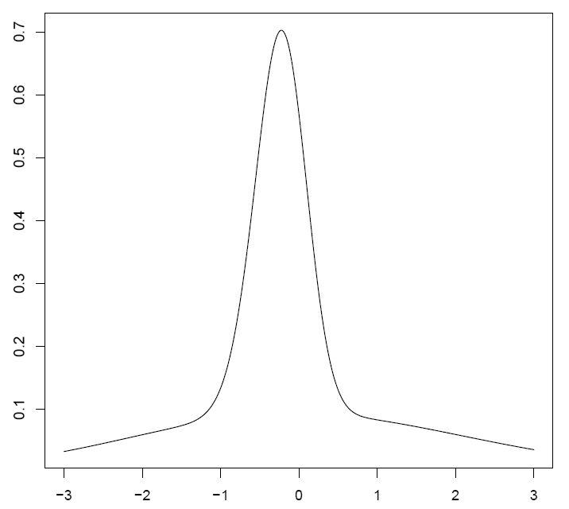

# 連結ガウス分布 - Connected Gaussian Distribution

連結ガウス分布とは、
正規分布 (ガウス分布) を区間で切断し、隙間を持たせてX軸方向に並べ、累積分布関数のグラフを徐々に変化させて、連続になるように繋げた確率分布です。
あるいは、それを拡張した、複数の正規分布のグラフが横方向や縦方向にグラデーション的に徐々に移り変わっていくような確率分布です。

連結ガウス分布を使えば、どんなクォンタイルを指定しても、それを極めて小さい誤差で再現する分布を構成できます。

中央値が等しく、分散が異なる正規分布を連結させることによって、
どんな経路 ([*](#ref-1)) を指定しても、
累積分布関数がその経路のすべての点を極めて小さい誤差で通過する確率分布を構成できるからです。

 <a id="ref-1">(*)</a> 経路 : ここでは、任意のクォンタイル (分位点) の列の意。

……と書くと、なんとなく凄そうな気がするかも知れませんが、
連結ガウス分布の確率密度関数は、一般に不連続で、いびつで、自然界には絶対に存在しなさそうな分布になります。
連結する隙間の部分に、凄いひずみを作るからです。

たとえば、こんな形の不連続な分布です。

 

ただし、クォンタイルが8点以下の場合は (たいていの場合、クォンタイルは3点か5点、あるいは7点でしょう)、
確率密度関数が連続な、自然界に存在しうるような分布モデルを構成することもできます。
設定 (type1.type, continuous / symmetric / v.grad) によって、

1. 2つの正規分布の平均 (type1.type = 1, continuous)、
2. 横方向 (X軸方向) にグラデーション的に正規分布の混合比率が変化する分布 (type1.type = 2, continuous)、
3. 確率密度関数の中央が鋭利に尖ったり、逆に凹んだりしている、左右対称な分布 (type1.type = 2, symmetric)、
4. 縦方向 (Y軸方向) にグラデーション的に正規分布の混合比率が変化する分布 (type1.type = 3)
5. 縦横両方向にグラデーション的に正規分布の混合比率が変化する分布 (type1.type = 4)

のような連続分布の分布モデルが作れます。たとえば、こんな形の分布が作れます。

 
 

これらの分布モデルは、正規分布に従わない、歪んだ分布や、裾野の広い分布のモデルなどに使えると思われます。

ともかく、このパッケージはそういった確率分布を構成するためのリファレンスクラスのパッケージです。

## 注意 - Remark

連結ガウス分布は混合ガウス分布とは少し違います。
混合ガウス分布は、複雑な分布のデータを複数の正規分布の混合と考え、1つのデータを複数の正規分布に従うデータに分離することを目的とした、クラスタリングの手法と考えられます。
それに対して、連結ガウス分布は、複雑な分布のデータをあるがままの一団のデータとして捉えて、解析したり、他のデータと比較したりすることを目的と考えています。

## これは何に使える？ - What can the CGD model be used for?

連結ガウス分布は以下のような目的に使うために、このパッケージの作者が考案しました。

+ 不連続な連結ガウス分布

    正規分布に従わない、分布モデルが不明なデータのクォンタイルが与えられているときに、リサンプルしたランダムデータが欲しい場合

+ 連続な連結ガウス分布

    無限個の正規分布の混合モデルを考える場合

このパッケージの作者は、とある医療・人体関係のデータを扱っていて、上記のようなデータに遭遇したので、このようなモデルを考案しました。

## インストール - Installation

<pre>
# Install devtools from CRAN
install.packages( "devtools" )

# Then use devtools::install_github( "user/repository" ) to install cgd package from GitHub
devtools::install_github( "Kimitsuna-Goblin/cgd" )
</pre>

## パッケージの使い方 - How to use this package

<pre>
> library( cgd )    # ライブラリを読み込みます
> a <- CGD$new()    # 連結ガウス分布クラスのオブジェクトを生成します
>
> ########################################################################
> # 経路 (クォンタイルの列) をトレースする方法
> ########################################################################
> # CGD$set.waypoints() : 経路 (クォンタイルの列) を指定し、
> #                       指定されたすべての点を通過する累積分布関数を持つ連結ガウス分布を構成します。
> #                       p は確率、q はクォンタイルのX座標値です。
> a$set.waypoints(
+   data.frame(
+     p = c( 0.1, 0.3, 0.5, 0.6, 0.7 ),
+     q = c( qnorm( c( 0.1, 0.3, 0.5, 0.6 ), 0, 1 ), 0.5 ) ) )
> NULL
>
> # trace.q() : クォンタイルの列をトレースする連結ガウス分布クラスオブジェクトを生成します
> #             CGD$set.waypoints() と同じです (new しなくて良い分、こちらの方が簡単です)
>
> a <- trace.q(
+   data.frame(
+     p = c( 0.1, 0.3, 0.5, 0.6, 0.7 ),
+     q = c( qnorm( c( 0.1, 0.3, 0.5, 0.6 ), 0, 1 ), 0.5 ) ) )
>
> # CGD$d() : X座標を指定して、確率密度を返します
> dev.new(); plot.new()
> plot( seq( -3, 3, 0.01 ), a$d( seq( -3, 3, 0.01 ) ), type = "l" )
>
> # CGD$p() : X座標を指定して、確率を返します
> dev.new(); plot.new()
> plot( seq( -3, 3, 0.01 ), a$p( seq( -3, 3, 0.01 ) ), type = "l" )
>
> # CGD$q() : 確率を指定して、クォンタイル (X座標) を返します
> #           確率が同一となるX座標が、ある区間内に無限に存在し、
> #           一意に定まらない場合は、該当区間の中点の座標を返します
> dev.new(); plot.new()
> plot( seq( 0, 1, 0.01 ), a$q( seq( 0, 1, 0.01 ) ), type = "l" )
>
> # CGD$r() : ランダムサンプルを生成します (高速化は全然やってません)
> dev.new(); plot.new()
> sample <- a$r( 1000 )
> hist( sample )
>
> a    # オブジェクトの内部構造を表示します
Reference class object of class "CGD"
Field "kind.index":
[1] 16
Field "kind":
[1] "Discontinuous Connected Gaussian Distribution"
Field "median":
[1] 0
Field "intervals":
[[1]]
Reference class object of class "CGDInterval"
Field "mean":
[1] 0
Field "sd":
[1] 1
Field "q.ind":
[1]      -Inf 0.2533471
Field "q.conn.prev":
[1] -Inf -Inf
Field "q.conn.next":
[1] 0.2533471 0.5244005
Field "p.ind":
[1] 0.0 0.6
Field "p.conn.prev":
[1] 0 0
Field "p.conn.next":
[1] 0.6 0.7

[[2]]
Reference class object of class "CGDInterval"
Field "mean":
[1] 0
Field "sd":
[1] 0.9534697
Field "q.ind":
[1] 0.5 Inf
Field "q.conn.prev":
[1] 0.2415588 0.5000000
Field "q.conn.next":
[1] Inf Inf
Field "p.ind":
[1] 0.7 1.0
Field "p.conn.prev":
[1] 0.6 0.7
Field "p.conn.next":
[1] 1 1

Field "type1.type":
[1] 1
Field "mean":
[1] -0.01719301
Field "sd":
[1] 0.9772327
Field "lsd":
[1] 0.9863357
Field "usd":
[1] 0.968044
Field "lsd.abs.error":
[1] 0
Field "usd.abs.error":
[1] 0
> # 各要素の意味はマニュアルまたはソースファイルのコメントを参照してください
>
> ########################################################################
> # 度数分布を近似する方法
> ########################################################################
> # 度数分布のデータを用意します
> x     <- seq( -2, 2, 0.2 )
> freq  <-  c(  15164,  22923,  25134,  27631,  37239,  40464,
+               47126,  79469, 109966, 118241, 111333,  78674,
+               46921,  41026,  36975,  27403,  25493,  22838,
+               14992,  11468,   9174 )
> total <- sum( freq )
>
> # CGD$nls.freq() : 与えられた度数分布に近くなるように連続分布を構成します
> #                  引数に、構成したい分布の種類を指定してください
> a$nls.freq( x, freq, total, kind = "Median-Equaled Sigma-Differed Vertical Gradational Distribution" )
Nonlinear regression model
  model: d ~ dp.t3(x, c(mean, mean, mean), c(sqrt.sd.1^2, sqrt.sd.2^2,     sqrt.sd.1^2), f.t3.d)
   data: list(d = get.d(x, freq, total), x = x)
     mean sqrt.sd.1 sqrt.sd.2
  -0.1992    1.0198    0.8050
 residual sum-of-squares: 0.02285

Number of iterations to convergence: 30
Achieved convergence tolerance: 9.922e-06
>
> # a <- nls.freq() のような書き方もできます (new しなくて良い分、こちらの方が簡単です)
> a <- nls.freq( x, freq, total, kind = "Median-Equaled Sigma-Differed Vertical Gradational Distribution" )
Nonlinear regression model
  model: d ~ dp.t3(x, c(mean, mean, mean), c(sqrt.sd.1^2, sqrt.sd.2^2,     sqrt.sd.1^2), f.t3.d)
   data: list(d = get.d(x, freq, total), x = x)
     mean sqrt.sd.1 sqrt.sd.2
  -0.1992    1.0198    0.8050
 residual sum-of-squares: 0.02285

Number of iterations to convergence: 30
Achieved convergence tolerance: 9.922e-06
>
> # CGD$d() : X座標を指定して、確率密度を返します
> dev.new(); plot.new()
> plot( seq( -3, 3, 0.01 ), a$d( seq( -3, 3, 0.01 ) ), type = "l" )
>
> # CGD$tex() : 得られた分布の累積分布関数と確率密度関数の表現式を TeX 形式で表示します
> a$tex()
\begin{align}
\Psi(x) &= \Phi_1(x) - \dfrac{1}{\sqrt{2}} \Phi^\ast_1(x) + \dfrac{1}{\sqrt{2}} \Phi^\ast_2(x),\\
g(x) &= \left( 1 - \dfrac{f_1(x)}{f_1(\mu_1)} \right) f_1(x) + \dfrac{f_2(x)}{f_2(\mu_2)} f_2(x),\\
\\
\Phi_i(x) &= \dfrac{1}{\sqrt{2 \pi \sigma_i^2}} \int_{-\infty}^{x}
 \exp \left( -\dfrac{(t - \mu_i)^2}{2 \sigma_i^2} \right) dt,\\
\Phi^\ast_i(x) &= \dfrac{1}{\sqrt{2 \pi \left( \begin{array}{c}
 \dfrac{\sigma_i}{\sqrt{2}} \end{array} \right)^2}}
 \int_{-\infty}^{x} \exp \left( \begin{array}{c} -\dfrac{(t - \mu_i)^2}{2
 \left( \begin{array}{c} \dfrac{\sigma_i}{\sqrt{2}} \end{array} \right)^2} \end{array} \right) dt,\\
f_i(x) &= \dfrac{1}{\sqrt{2 \pi \sigma_i^2}} \exp \left( -\dfrac{(x - \mu_i)^2}{2 \sigma_i^2} \right),\\
\\
& \begin{array}{l}
\mu_1 = -0.199217, & \sigma_1 = 1.039974,\\
\mu_2 = \mu_1, & \sigma_2 = 0.648027.
\end{array}
\end{align}
>
> # nls.freq.all() : パッケージでサポートされているすべての連続分布の中から、
> #                  与えられた度数分布に最も近い分布を探します (少し時間がかかります)
> result <- nls.freq.all( x, freq, total )
>
> # cgd:::kinds : サポートされている分布の種類です ( 1 ～ 15 は連続分布、 16 は不連続分布です)
> cgd:::kinds
 [1] "Normal Distribution"
 [2] "Mean of Median-Equaled Sigma-Differed 2 Normal Distributions"
 [3] "Symmetric Horizontal Gradational Distribution"
 [4] "Median-Differed Sigma-Equaled Horizontal Gradational Distribution"
 [5] "Median-Equaled Sigma-Differed Horizontal Gradational Distribution"
 [6] "Median-Differed Sigma-Differed Horizontal Gradational Distribution"
 [7] "Median-Differed Sigma-Equaled Vertical Gradational Distribution"
 [8] "Median-Equaled Sigma-Differed Vertical Gradational Distribution"
 [9] "Median-Differed Sigma-Differed Vertical Gradational Distribution"
[10] "3-Median-Differed Sigma-Equaled Vertical Gradational Distribution"
[11] "Median-Equaled 3-Sigma-Differed Vertical Gradational Distribution"
[12] "3-Median-Differed 3-Sigma-Differed Vertical Gradational Distribution"
[13] "Median-Differed Sigma-Equaled Vertical-Horizontal Gradational Distribution"
[14] "Median-Equaled Sigma-Differed Vertical-Horizontal Gradational Distribution"
[15] "Median-Differed Sigma-Differed Vertical-Horizontal Gradational Distribution"
[16] "Discontinuous Connected Gaussian Distribution"
>
> # nls.freq.all()$cor : 各モデルと度数分布との相対係数です
> result$cor
 [1] 0.9286582 0.9878450 0.9277467 0.8812164 0.9551502 0.8499192 0.9551271
 [8] 0.9867571 0.9867073 0.9945393 0.9867147 0.9538990 0.8879331 0.9732565
[15] 0.9964684
>
> # nls.freq.all()$best.cor : 各モデルと度数分布との相対係数のうち、最大の値です
> result$best.cor
[1] 0.9964684
>
> # nls.freq.all()$best : 最も度数分布に近い結果が得られたモデルです
> # CGD$kind : その分布モデルの種類を表す文字列です
> result$best$kind
[1] "Median-Differed Sigma-Differed Vertical-Horizontal Gradational Distribution"
>
> # CGD$d() : X座標を指定して、確率密度を返します
> dev.new(); plot.new()
> plot( seq( -3, 3, 0.01 ), result$best$d( seq( -3, 3, 0.01 ) ), type = "l" )
</pre>

## 連結ガウス分布の構成方法 (一般の場合)  - How to construct a Connected Gaussian Distribution (generally)

一般に、 (不連続な) 連結ガウス分布は次のようにして構成することができる。

1. まず、確率が取りうる値の全体である $[0, 1]$ 区間の部分閉区間を有限個 ( $n$ 個) 持つ集合 $P$ を、閉区間同士が互いに重なり合わないようにして用意する。
ただし、閉区間のどれか1つに必ず 0 が含まれ、どれか1つに必ず 1 が含まれるようにする。

つまり、

$$
P = \left\lbrace P_i \subset [0, 1] \mid P_i=[a_i, b_i] \  ( 1 \leq i \leq n, \  0 \leq a_i \leq b_i \leq 1 ), \  a_1=0, \  b_n=1,
    \  i \neq j \Rightarrow P_i \cap P_j = \varnothing \right\rbrace
$$

を満たすような、閉区間の集合 $P$ を用意する (便宜上、 $P$ の最初の要素 $P_1$ に 0 が含まれ、最後の要素 $P_n$ に 1 が含まれるものとした)。

各要素 $P_i$ は、1点のみからなる区間 $[a_i, a_i] ( 0 \leq a_i \leq 1 )$ でもよい。

それぞれの閉区間 $P_i$ は昇順に並んでいることが望ましい。
すなわち、 $1 \leq i \leq n - 1$ に対して、 $b_i ＜ a_{i+1}$ となっていることが望ましい
 (以下、 $P$ はこの条件を満たすものとする)。

ここで、予め、有限の $m$ 個の点からなる、累積分布関数が通過すべき経路 (クォンタイルの列)
$W = \left\lbrace ( x_j, p_j ) \in ( \mathbb{R}, [0, 1] ) \mid 1 \leq j \leq m \right\rbrace$
が与えられているときは、
その経路のすべての点の確率 $p_j$ $( 1 \leq j \leq m )$ の値が、それぞれ、いずれかの $P_i$ に必ず含まれるように取る
 (便宜上、経路 $W$ において、確率 $\left\lbrace p_j \right\rbrace$ は昇順に並んでいるものとする)。

この際、もし、 $n$ を $m$ と等しく取り、それぞれ1つの閉区間 $P_i$ $( 1 \leq i \leq n = m )$ に、
経路の点の確率 $p_i$ がただ1つだけ含まれるように $P$ を用意するならば、
後の工程が確実に実行できる。
ただし、もし後の工程が実行可能であれば、
1つの閉区間 $P_i$ に、経路の複数の点の確率 $p_j, p_{j+1}, p_{j+2}, \cdots$ が含まれるように用意してもよい。

2. 閉区間の集合 $P$ の要素数と等しい、
$n$ 個の正規分布からなる集合 $N = \left\lbrace N_1, N_2, \cdots, N_n \right\rbrace$ を用意して、
その要素の正規分布 $N_i$ $( 1 \leq i \leq n )$ に、
閉区間 $P_i$ をそれぞれ1つずつ割り当てる。

このとき、集合 $N$ が以下の2つの条件を満たすように、正規分布 $N_i$ を用意する。

+ 任意の2つの $N_i, N_j ( i \neq j )$ について、
$N_i, N_j$ に閉区間 $P_i, P_j$ が割り当てられているとき、
$N_i, N_j$ の累積分布関数 $\Phi_i( x ), \Phi_j( x )$ について、
それぞれの区間に対する定義域 $\lbrace x \mid \Phi_i( x ) \in P_i \rbrace$ と
$\lbrace x \mid \Phi_j( x ) \in P_j \rbrace$ が、互いに重ならないこと。
逆関数を使って言い換えれば、
$\left\lbrace \Phi_i^{-1}( p ) \mid p \in P_i \right\rbrace ∩ \left\lbrace \Phi_j^{-1}( p ) \mid p \in P_j \right\rbrace = \varnothing$
であること。
+ 経路 $W = \left\lbrace ( x_j, p_j ) \right\rbrace$ が与えられており、
経路の点の確率 $p_j$ が閉区間 $P_i$ に含まれているときは、
その区間が割り当てられている確率分布 $N_i$ の累積分布関数 $\Phi_i$ が、必ずその経路の点 $( x_j, p_j )$ を通過すること。
すなわち、 $p_j \in P_i \Rightarrow \Phi_i( x_j ) = p_j$ が成り立つこと。

なお、集合 $N$ の要素の中には、 $N_i = N_j ( i \neq j )$ なる同一の分布が存在してもよい。

ある1つの閉区間 $P_i$ の中に、経路の複数の点の確率 $p_j, p_{j+1}, p_{j+2}, ...$ が含まれる場合は、
特別な場合を除いて、一般に、上の2つの条件を満たす正規分布の集合 $N$ を構成することはできない。
しかし、すべての閉区間 $P_i$ が高々1個の経路の点の確率 $p_j$ しか含まず、
特に、すべての閉区間 $P_i$ が1点のみからなる場合は、
上の2つの条件を満たす正規分布の集合 $N$ は、必ず構成することができる (自明であろう)。

さて、これまでの工程によって、
与えられた経路の点をすべて通過する、累積分布関数の不連続な断片が構成できたので、
あとは、それらの断片を連続になるように接続すればよい。
そこで、最終的な工程として、次のように断片の接続を行う。

以下、記述を簡単にするため、
閉区間 $P_i = [a_i, b_i]$ に対し、
その区間が割り当てられた正規分布 $N_i$ の累積分布関数 $\Phi_i( x )$ の定義域を
$[\alpha_i, \beta_i]$ と書く。
同様に、 $P_{i+1} = [a_{i+1}, b_{i+1}]$ に対する $\Phi_{i+1}( x )$ の定義域を $[\alpha_{i+1}, \beta_{i+1}]$ と書く。
また、2つの閉区間 $P_i = [a_i, b_i], P_{i+1} = [a_{i+1}, b_{i+1}]$ の間の開区間 $(b_i, a_{i+1})$ を $Q_i$ と書く。

3. 開区間 $Q_i = (b_i, a_{i+1})$ $( 1 \leq i \leq n - 1 )$ に対して、
$\Psi_i( \beta_i ) = b_i, \Psi_i( \alpha_{i+1} ) = a_{i+1}$ を満たすような、
区間 $[\beta_i, \alpha_{i+1}]$ において単調増加する連続関数 $\Psi_i(x)$ を適当に定める。
注意点として、 $x$ が $\beta_i < x < \alpha_{i+1}$ の範囲を動くとき、
$\Psi_i(x)$ の値は必ず $Q_i$ の範囲の中に収まらなければならず、決して $Q_i$ の範囲外に出てはならない。

以上のように関数 $\Phi_i( x ), \Psi_i( x )$ を定めたとき、
関数

$$
\Phi_{CGD}(x)=
\begin{cases}
\Phi_i(x) & \textrm{where } x \in [\alpha_i, \beta_i], \quad i = 1, \cdots, n \\
\Psi_i(x) & \textrm{where } x \in (\beta_i, \alpha_{i+1}), \quad i = 1, \cdots, n - 1
\end{cases}
$$

を累積分布関数とする確率分布が定義できる。
以上のように構成した累積分布関数を持つ確率分布を **「連結ガウス分布」** と呼ぶ。

これまで述べてきた閉区間 $P_i$ と開区間 $Q_i$ の呼称について、
閉区間 $P_i =  [a_i, b_i]$ は、
1つの正規分布の累積分布関数 $\Phi_i(x)$ が、単独で独立的に $\Phi_{CGD}(x)$ を負担している区間であることから、
これを **「独立区間」** あるいは「独立区間の確率」と呼び、
累積分布関数の定義域 $\lbrace x \in [\alpha_i, \beta_i] \rbrace$ を「独立区間の定義域」と呼ぶ。
それに対して、開区間 $Q_i = (b_i, a_{i+1})$ は、2つの独立区間を接続していることから、
これを **「接続区間」** あるいは「接続区間の確率」と呼ぶ。
また、 $Q_i$ を値域とする、累積分布関数に相当する関数 $\Psi_i(x)$ を **「接続関数」** と呼び、
その定義域 $\lbrace x \in (\beta_i, \alpha_{i+1}) \rbrace$ を「接続区間の定義域」と呼ぶ。

以上、任意の経路の点を通過する、不連続な連結ガウス分布の構成方法を述べたが、
独立区間を $[0, 0]$ や $[1, 1]$ 、 $[0.5, 0.5]$ といった、特別な1点からなる区間のみに限定すれば、確率密度関数が連続な分布を構成することも可能である。

## 不連続な分布の構成方法 (本パッケージの場合)   - The way to construct a Uncontinuous distribution (in this package)

### 独立区間および正規分布の構成 - Construction of indipendent intervals and normal distributions

経路をトレースするような (つまり、累積分布関数が経路の点をすべて通過するような) 不連続な連結ガウス分布を構成する場合、
本パッケージでは、以下のように独立区間を構成する。

+ 原則として、経路の点 $(x_i, a_i)$ の確率 $a_i$ に対し、1点のみからなる区間 $[a_i, a_i]$ を独立区間の確率とする。
ただし、以下の2つの場合を例外とする。

    + 経路の点のうち、確率が 0 または 1 でない最初の点 $( x_1, b_1 )$ および
      最後の点 $( x_n, a_n )$ $( 0 < b_1, a_n < 1 )$ の確率 $b_1, a_n$ に対しては、
      確率 0 および 1 を含む区間 $[0, b_1], [a_n, 1]$ を独立区間の確率とする。

    + 2つ以上の連続する経路の点が、
      1つの同じ正規分布 (ただし、中央値は経路の点 $( x, 0.5 )$ の $x$ の値とする)
      の累積分布関数上の点となる場合は、
      それらの点の確率をまとめて1つの独立区間の確率に含める。
      ただし、独立区間の確率の上限と下限は、必ず経路に含まれる点の確率か、
      または 0 または 1 のいずれかとする。

独立区間の定義域を負担する正規分布は、以下のように構成する。

+ 正規分布の中央値は、経路で与えられた点 $( x, 0.5 )$ の $x$ の値とする。

+ 最初の独立区間の確率 $[0, b_1]$ の定義域 $[-\infty, \beta_1]$ に対しては、
累積分布関数が経路の点 $( \beta_1, b_1 )$ を通るような正規分布を採用し、
それ以外の独立区間の確率 $[a_i, b_i]$ の定義域 $[\alpha_i, \beta_i]$ に対しては、
累積分布関数が経路の点 $( \alpha_i, a_i )$ を通るような正規分布を採用する
 (その累積分布関数は必ず点 $( \beta_i, b_i )$ も通る)。

ここで、ある正規分布 $N( \mu, \sigma^2 )$ があって、
$N( \mu, \sigma^2 )$ の累積分布関数が点 $x = q$ で確率 $p$ を取るとする。
このとき、標準偏差 $\sigma$ を $\mu, q, p$ を使って表すことを考える。

点 $x = q$ における、正規分布 $N( \mu, \sigma^2 )$ の確率 $p$ は

$$
p = \dfrac{1}{ \sqrt{ 2 \pi \sigma^2 } } \int_{-\infty}^{q} \exp( -\dfrac{ ( x - \mu )^2 }{ 2 \sigma^2 } ) dx
$$

で表される。この式の右辺を $t = \dfrac{ x - \mu }{ \sigma }$ と置いて変換すると、

$$
\begin{eqnarray}
p &=& \dfrac{1}{ \sqrt{ 2 \pi } } \int_{-\infty}^{ \dfrac{ q - \mu }{ \sigma } } \exp( -\dfrac{ t^2 }{ 2 } ) dt \\
  &=& \Phi( \dfrac{ q - \mu }{ \sigma } )
\end{eqnarray}
$$

となる。ただし、 $\Phi( x )$ は標準正規分布 $N( 0, 1 )$ の累積分布関数である。
$\Phi( x )$ の逆関数 $\Phi^{-1}( x )$ を使って、この式を変形すると、

$$
\sigma = \dfrac{ q - \mu }{ \Phi^{-1}( p ) } \quad ( q \neq \mu, \  0  < p < 1 \  \land \  p \neq 0.5 )
$$

という式が得られる。ここに、標準偏差 $\sigma$ を $\mu, q, p$ を使って表すことができた。

この式から、正規分布の平均値 (すなわち中央値) と、
それ以外の任意の1点のX座標とその点における確率を与えれば、
それらの条件を満たす正規分布の標準偏差が得られる。
したがって、上に述べたような正規分布は容易に見つけることができる。

本パッケージでは、この式を使って正規分布を構成し、
連結ガウス分布の累積分布関数 $\Phi_{CGD}(x)$ の独立区間の部分を得る。

### 接続関数の構成 - Construction of connecting functions

不連続な連結ガウス分布の接続関数は、
以下のように、type 1, type 2, type 3a, type 3b の4つの場合に分けて構成する
 (オプション type1.type = 1 または 2 の場合。オプションの詳細については後述)。

以下、独立区間の定義域 $[\alpha_i, \beta_i]$
を負担する正規分布 $N_i$ の標準偏差を $\sigma_i$ 、平均値を $\mu_i$ と書く。
正規分布では、平均値と中央値は等しいことに注意されたい。
また、正規分布 $N_i$ の累積分布関数を $\Phi_i( x )$ 、確率密度関数を $f_i( x )$ と書く。
なお、不連続な連結ガウス分布の場合、すべての正規分布 $N_i$ の平均値 (中央値) は等しい値に取る。
そして、その値はそのまま連結ガウス分布の中央値になる。
以下、連結ガウス分布の中央値を添字のない $m$ と書く。
すなわち、 $\any i, \mu_i = m$ を満たすものとする。

また、接続区間の確率 $Q_i = ( b_i, a_{i + 1} )$ に対して、
接続区間の定義域を $( \beta_i, \alpha_{i+1} )$ と書く。
すなわち、 $\Phi_i( \beta_i ) = b_i, \Phi_{i + 1}( \alpha_{i+1} ) = a_{i + 1}$ とする。

#### Type 1 - 接続区間の定義域 $( \beta_i, \alpha_{i+1} )$ が中央値 $m$ を含まない場合 その1
+ 接続区間の定義域の上限 $\alpha_{i+1}$ が $m$ より小さく、標準偏差が $\sigma_i < \sigma_{i + 1}$ の場合
+ 接続区間の定義域の下限 $\beta_i$ が $m$ より大きく、標準偏差が $\sigma_i > \sigma_{i + 1}$ の場合

分布の山側の標準偏差が、裾側よりも大きい場合である。
この場合は、すべての $x \in (\beta_i, \alpha_{i+1})$ に対して、
累積分布関数 $\Phi_i( x ), \Phi_{i + 1}( x )$ の値が両方とも接続区間の確率 $Q_i$ の範囲内に収まり、範囲外に出ることがない。
そのため、4つの場合の中で、最も自由に接続関数を構成することできる。

本パッケージでは、 type1.type というオプションによって、以下の [表1](#tbl-1) のように接続関数を構成する。
このオプションの名前は「 type 1 の接続区間における計算方法が異なる」という意味で付けられた。

表中の式で、 $\Phi_i( x ), \Phi_{i+1}( x )$ は正規分布 $N_i,N_{i+1}$ の累積分布関数である。
$f_i( x ), f_{i+1}( x )$ は同じく正規分布 $N_i,N_{i+1}$ の確率密度関数である。
$\bar \Phi_i( x ) = ( \Phi_i( x ) + \Phi_{i+1}( x ) ) / 2$ である。

+ <a id="tbl-1">**表1. 不連続な連結ガウス分布のオプション**</a>

| オプション  | 接続関数 $\Psi_i(x)$ ・確率密度関数 $g_i(x)$ | 通過できる経路の点の個数 | 確率密度関数の連続性 |
| :--------: | :----------------------------------------- | :--------------------: | :----------------: |
| type1.type = 0 | 接続関数なし (独立区間の両端の2点を通る正規分布を横に並べただけの分布) | 任意   (2個以上、上限なし) | 不連続 |
| type1.type = 1 | $\Psi_i( x ) = \dfrac{ \alpha_{i+1} - x }{ \alpha_{i+1} - \beta_i } \Phi_i( x ) + \dfrac{ x - \beta_i }{ \alpha_{i+1} - \beta_i } \Phi_{i+1}( x )$   $g_i( x ) = \dfrac{ \alpha_{i+1} - x }{ \alpha_{i+1} - \beta_i } f_i( x ) + \dfrac{ x - \beta_i }{ \alpha_{i+1} - \beta_i } f_{i+1}( x ) + \dfrac{ \Phi_{i+1}( x ) - \Phi_i( x ) }{ \alpha_{i+1} - \beta_i }$ | 任意   (1個以上、上限なし) | 不連続 |
| type1.type = 2  | $\Psi_i( x ) = \dfrac{ \bar \Phi_i( \alpha_{i+1} ) - \bar \Phi_i( x ) }{ \bar \Phi_i( \alpha_{i+1} ) - \bar \Phi_i( \beta_i ) } \Phi_i( x ) + \dfrac{ \bar \Phi_i( x ) - \bar \Phi_i( \beta_i ) }{ \bar \Phi_i( \alpha_{i+1} ) - \bar \Phi_i( \beta_i ) } \Phi_{i+1}( x )$   $g_i( x ) = \dfrac{ \bar \Phi_i( \alpha_{i+1} ) -\Phi_i( x ) }{ \bar \Phi_i( \alpha_{i+1} ) - \bar \Phi_i( \beta_i ) } f_i( x ) + \dfrac{ \Phi_{i+1}( x ) - \bar \Phi_i( \beta_i ) }{ \bar \Phi_i( \alpha_{i+1} ) - \bar \Phi_i( \beta_i ) } f_{i+1}( x )$ | 任意   (1個以上、上限なし) | 不連続 |

#### Type 2 - 接続区間の定義域 $( \beta_i, \alpha_{i+1} )$ が中央値 $m$ を含まない場合 その2
+ 接続区間の定義域の上限 $\alpha_{i+1}$ が $m$ より小さく、標準偏差が $\sigma_i \geq \sigma_{i + 1}$ の場合
+ 接続区間の定義域の下限 $\beta_i$ が $m$ より大きく、標準偏差が $\sigma_i \leq \sigma_{i + 1}$ の場合

分布の山側の標準偏差が、裾側よりも小さい場合である。
この場合は、一部の $x \in (\beta_i, \alpha_{i+1})$ に対して、 $\Phi_i( x )$ と $\Phi_{i+1}( x )$ の値が
接続区間の確率 $Q_i$ の範囲外に出てしまう。
そのため、接続関数 $\Psi_i( x )$ を構成する際は、値が $Q_i$ の範囲から出ないように注意する必要がある。
なお、範囲外に出るケースは、 $\Phi_i( \alpha_{i+1} ) > \Phi_{i+1}( \alpha_{i+1} ) \ (= a_{i + 1})$ または $\Phi_{i+1}( \beta_i ) < \Phi_i( \beta_i ) \ (= b_i)$ となる場合である。

本パッケージでは、以下のように $\Psi_i( x )$ を構成する。それぞれの式と条件に出てくる添字に注意せよ。

$$
\Psi_i( x ) =
\begin{cases}
\dfrac{1}{2} ( \Phi_i( x ) + b_i ) & \textrm{where} \quad \Phi_i( x ) < a_{i+1}, \quad \Phi_{i+1}( x ) < b_i \\
\dfrac{1}{2} ( a_{i+1} + b_i ) & \textrm{where} \quad \Phi_i( x ) \geq a_{i+1}, \quad \Phi_{i+1}( x ) < b_i \\
\dfrac{1}{2} ( \Phi_i( x ) + \Phi_{i+1}( x ) ) & \textrm{where} \quad \Phi_i( x ) < a_{i+1}, \quad \Phi_{i+1}( x ) \geq b_i \\
\dfrac{1}{2} ( a_{i+1} + \Phi_{i+1}( x ) ) & \textrm{where} \quad \Phi_i( x ) \geq a_{i+1}, \quad \Phi_{i+1}( x ) \geq b_i
\end{cases}
$$

このとき、確率密度関数 $g_i( x )$ は

$$
g_i( x ) =
\begin{cases}
\dfrac{1}{2} f_i( x ) & \textrm{where} \quad \Phi_i( x ) < a_{i+1}, \quad \Phi_{i+1}( x ) < b_i \\
0 & \textrm{where} \quad \Phi_i( x ) \geq a_{i+1}, \quad \Phi_{i+1}( x ) < b_i \\
\dfrac{1}{2} ( f_i( x ) + f_{i+1}( x ) ) & \textrm{where} \quad \Phi_i( x ) < a_{i+1}, \quad \Phi_{i+1}( x ) \geq b_i \\
\dfrac{1}{2} f_{i+1}( x ) & \textrm{where} \quad \Phi_i( x ) \geq a_{i+1}, \quad \Phi_{i+1}( x ) \geq b_i
\end{cases}
$$

となる。このとき、 $f( x )$ は多くの点で不連続になる。

#### Type 3a - 接続区間の定義域 $( \beta_i, \alpha_{i+1} )$ が中央値 $m$ を含む場合 その1
+ $\beta_i \leq \mu \leq \alpha_{i+1}$ であり、標準偏差が $\sigma_i < \sigma_{i + 1}$ の場合

この場合は $x \in (\beta_i, \alpha_{i+1})$ に対して、 $\Phi_{i+1}( x )$ は接続区間の確率 $Q_i$ の範囲内に常に収まるが、
$\Phi_i( x )$ は $x > \mu$ となる後半部分で、 $\Phi_i( x ) > a_{i+1}$ となり、 $Q_i$ の範囲外に出ることがある。
そのため、接続関数 $\Psi_i( x )$ は、その値が $Q_i$ の範囲から出ないように注意して、以下のように構成する。

$$
\Psi_i( x ) =
\begin{cases}
\Phi_i( x ) & \textrm{where} \quad x \leq \mu \\
\dfrac{1}{2} ( \Phi_i( x ) + \Phi_{i+1}( x ) ) & \textrm{where} \quad x > \mu, \quad \Phi_i( x ) < a_{i+1} \\
\dfrac{1}{2} ( a_{i+1} + \Phi_{i+1}( x ) ) & \textrm{where} \quad x > \mu, \quad \Phi_i( x ) \geq a_{i+1}
\end{cases}
$$

このとき、確率密度関数 $g_i( x )$ は

$$
g_i( x ) =
\begin{cases}
f_i( x ) & \textrm{where} \quad x \leq \mu \\
\dfrac{1}{2} ( f_i( x ) + f_{i+1}( x ) ) & \textrm{where} \quad x > \mu, \quad \Phi_i( x ) < a_{i+1} \\
\dfrac{1}{2} f_{i+1}( x ) & \textrm{where} \quad x > \mu, \quad \Phi_i( x ) \geq a_{i+1}
\end{cases}
$$

となる。

type1.type = 1, continuous = TRUE のときは、この type 3 の計算を拡張して、2つの正規分布の平均とする。

#### Type 3b - 接続区間の定義域 $( \beta_i, \alpha_{i+1} )$ が中央値 $m$ を含む場合 その2
+ $\beta_i \leq \mu \leq \alpha_{i+1}$ であり、標準偏差が $\sigma_i > \sigma_{i + 1}$ の場合

この場合は type 3a と対称的である。
すなわち、 $x \in (\beta_i, \alpha_{i+1})$ に対して、 $\Phi_i( x )$ は接続区間の確率 $Q_i$ の範囲内に常に収まるが、
$\Phi_{i+1}( x )$ は $x < \mu$ となる前半部分で、 $\Phi_{i+1}( x ) < b_i$ となり、 $Q_i$ の範囲外に出ることがある。
そのため、接続関数 $\Psi_i( x )$ は、その値が $Q_i$ の範囲から出ないように、以下のように構成する。

$$
\Psi_i( x ) =
\begin{cases}
\dfrac{1}{2} ( \Phi_i( x ) + b_i ) & \textrm{where} \quad x \leq \mu, \quad \Phi_{i+1}( x ) < b_i \\
\dfrac{1}{2} ( \Phi_i( x ) + \Phi_{i+1}( x ) ) & \textrm{where} \quad x \leq \mu, \quad \Phi_{i+1}( x ) \geq b_i \\
\Phi_{i+1}( x ) & \textrm{where} \quad x > \mu
\end{cases}
$$

このとき、確率密度関数 $g_i( x )$ は

$$
g_i( x ) =
\begin{cases}
\dfrac{1}{2} f_i( x ) & \textrm{where} \quad x \leq \mu, \quad \Phi_{i+1}( x ) < b_i \\
\dfrac{1}{2} ( f_i( x ) + f_{i+1}( x ) ) & \textrm{where} \quad x \leq \mu, \quad \Phi_{i+1}( x ) \geq b_i \\
f_{i+1}( x ) & \textrm{where} \quad x > \mu
\end{cases}
$$

となる。

## 連続な分布の構成方法 (本パッケージの場合)   - The way to construct a Continuous distribution (in this package)

連結ガウス分布の独立区間の確率を $[0, 0]$ 、 $[1, 1]$ (あるいは $[0.5, 0.5]$) といった特別な場合に限定し、
接続区間の確率を $(0, 1)$ として、接続区間の定義域を $(-\infty, \infty)$ とすれば、連続分布を構成できる。
このとき、連続分布の累積分布関数は、不連続分布の接続関数 $\Psi_i(x)$ に相当する。

したがって、
不連続分布の type 1 の接続関数 $\Psi_i(x)$ の定義域を $(-\infty, \infty)$ まで拡張すれば、
連続分布の累積分布関数が定義できる。
type1.type = 2 のとき、そのような拡張が可能である。

以下、連続な連結ガウス分布の累積分布関数を添字のない $\Psi(x)$ 、確率密度関数を $g(x)$ と書くことにする。

連続な連結ガウス分布の場合、与えられた経路の点を通過させるには、
経路の点 $(x_k, p_k) \ (k = 1, 2, ...)$ に対して、累積分布関数 $\Psi(x)$ が

$$
\Psi(x_k) = p_k \quad (k = 1, 2, ...)
$$

を満たせばよい。
この連立方程式は nleqslv パッケージを使って解くことができる。

ただし、連立方程式の式の数は、変数の個数を超えられないので、通過できる経路の点の個数には限界がある。
ここでの変数は、連結ガウス分布を構成する正規分布の平均値と標準偏差である。
つまり、正規分布の平均値と標準偏差の個数を超える点を通過できる分布は、一般に構成できない。
また、経路の点が多くなくても、経路の点の並び方によっては、連立方程式の実解が得られず、分布が構成できないことがある。

本パッケージでは、 type1.type オプションによって、以下の [表2](#tbl-2) のような分布を構成できる。
オプションによって、通過できる経路の点の条件が異なるので、条件に応じたオプションを選ぶとよい。

表中の式で、 $\Phi_i( x )$ は構成要素の正規分布 $N_i = N( \mu_i, \sigma_i^2 )$ の累積分布関数である。
$f_i( x )$ は構成要素の正規分布 $N_i$ の確率密度関数である。
添字のない $m$ は連結ガウス分布の平均値である。なお、連続分布の場合、 $m = \mu_i$ とは限らない。
$\Phi^\ast_i(x)$ は正規分布 $N( \mu_i, ( \dfrac{ \sigma_i }{ \sqrt2 } )^2 )$ の累積分布関数 である。

+ <a id="tbl-2">**表2. 連続な連結ガウス分布のオプション**</a>

| オプション  | 累積分布関数 $\Psi(x)$ ・確率密度関数 $g(x)$ | 通過できる経路の点の個数 | 独立区間の確率 | 確率密度関数の連続性 |
| :--------: | :--------------------------------------- | :------: | :----: | :----------------: |
| type1.type = 1,   continuous = TRUE (or symmetric = TRUE)   (2つの正規分布の平均) | $\Psi( x ) = \dfrac{1}{2} ( \Phi_1( x ) + \Phi_2( x ) )$   $g( x ) = \dfrac{1}{2} ( f_1( x ) + f_2( x ) )$   where $\mu = \mu_1 = \mu_2$ | 3点 | $[0, 0]$, $[1, 1]$ の2点 | 連続 ( $C^\infty$ 級) |
| type1.type = 2,   continuous = TRUE   (横方向グラデーション) | $\Psi( x ) = \Phi_1( x ) - \dfrac{1}{2} \Phi_1( x )^2 + \dfrac{1}{2} \Phi_2( x )^2$   $g( x ) = ( 1 - \Phi_1( x ) )f_1( x ) + \Phi_2( x ) f_2( x )$ | 3～4点 | $[0, 0]$, $[1, 1]$ の2点 | 連続 ( $C^\infty$ 級) |
| type1.type = 2,   symmetric = TRUE   (左右対称) | $\Psi( x ) = \genfrac{\lbrace}{}{0pt}{0}{ \Psi_1( x ) = \Phi_1( x ) - \Phi_1( x )^2 + \Phi_2( x )^2 \qquad \qquad ( x \leq \mu ) }{ \Psi_2( x ) = 1 - \Psi_1( 2\mu - x ) \qquad \qquad \qquad \qquad \  ( x > \mu ) }$   $g( x ) = \genfrac{\lbrace}{}{0pt}{0}{ g_1( x ) = ( 1 - 2\Phi_1( x ) ) f_1( x ) + 2\Phi_2( x ) f_2( x ) \quad \ ( x \leq \mu ) }{ g_2( x ) = g_1( 2\mu - x ) \qquad \qquad \qquad \qquad \qquad \  \  \  \  ( x > \mu ) }$ | $( \mu, 0.5 )$ を含む3点 | $[0, 0]$, $[0.5, 0.5]$, $[1, 1]$ の3点 | 連続 |
| type1.type = 3   (下側の分布が左右で異なる、   歪んだ縦方向グラデーション) | $\Psi( x ) = \Psi_1( x ) + \Psi_2( x ) + \Psi_3( x )$   $\qquad \Psi_1( x ) = \mathrm{ min }( \Phi_1( x ) - \dfrac{1}{ \sqrt{2} } \Phi^\ast_1( x ), \  \dfrac{2 - \sqrt{2}}{4} )$   $\qquad \Psi_2( x ) = \dfrac{1}{ \sqrt{2} } \Phi^\ast_2( x )$   $\qquad \Psi_3( x ) = \mathrm{ max }( 0, \  \Phi_3( x ) - \dfrac{1}{ \sqrt{2} } \Phi^\ast_3( x ) - \dfrac{2 - \sqrt{2}}{4} )$   $g( x ) = g_1( x ) + g_2( x ) + g_3( x )$   $\qquad g_1( x ) = \genfrac{\lbrace}{}{0pt}{0}{ ( 1 - \dfrac{ f_1( x ) }{ f_1( \mu_1 ) } ) f_1( x ) \quad \ \  ( x \leq \mu_1 ) }{ 0 \qquad \qquad \qquad \qquad \quad ( x > \mu_1 ) }$   $\qquad g_2( x ) = \dfrac{ f_2( x ) }{ f_2( \mu_2 ) } f_2( x )$   $\qquad g_3( x ) = \genfrac{\lbrace}{}{0pt}{0}{ 0 \qquad \qquad \qquad \qquad \quad ( x < \mu_3 ) }{ ( 1 - \dfrac{ f_3( x ) }{ f_3( \mu_3 ) } ) f_3( x ) \quad \ \  ( x \geq \mu_3 ) }$ | 3～6点 | $[0, 0]$, $[1, 1]$ の2点   あるいは $[0.5, 0.5]$ を加えた3点     (ただし、条件によっては、 $[0, 0.5]$ 、 $[0.5, 1]$ または $[0, 1]$ の区間を取りうる) | 連続 ( $C^1$ 級)
| type1.type = 3,   v.grad = TRUE   (2つの正規分布の縦方向グラデーション) |  $\Psi( x ) = \Phi_1( x ) - \dfrac{1}{ \sqrt{2} } \Phi^\ast_1( x ) + \dfrac{1}{ \sqrt{2} } \Phi^\ast_2( x )$   $g( x ) = ( 1 - \dfrac{ f_1( x ) }{ f_1( \mu_1 ) } ) f_1( x ) + \dfrac{ f_2( x ) }{ f_2( \mu_2 ) } f_2( x )$ | 3～4点 | $[0, 0]$, $[1, 1]$ の2点   あるいは $[0.5, 0.5]$ を加えた3点 | 連続 ( $C^\infty$ 級) |
| type1.type = 4   (縦横グラデーション) |  $\Psi( x ) = \Psi_1( x ) - \dfrac{1}{2} \Psi_1( x )^2 + \dfrac{1}{2} \Psi_2( x )^2$   $\qquad \Psi_1( x ) = \Phi_{1, 1}( x ) - \dfrac{1}{ \sqrt{2} } \Phi^\ast_{1, 1}( x ) + \dfrac{1}{ \sqrt{2} } \Phi^\ast_{1, 2}( x )$   $\qquad \Psi_2( x ) = \Phi_{2, 1}( x ) - \dfrac{1}{ \sqrt{2} } \Phi^\ast_{2, 1}( x ) + \dfrac{1}{ \sqrt{2} } \Phi^\ast_{2, 2}( x )$   $g( x ) = ( 1 - \Psi_1( x ) ) g_1( x ) + \Psi_2( x ) g_2( x )$   $\qquad g_1( x ) = ( 1 - \dfrac{ f_{1, 1}( x ) }{ f_{1, 1}( \mu_{1, 1} ) } ) f_{1, 1}( x ) + \dfrac{ f_{1, 2}( x ) }{ f_{1, 2}( \mu_{1, 2} ) } f_{1, 2}( x )$   $\qquad g_2 ( x ) = ( 1 - \dfrac{ f_{2, 1}( x ) }{ f_{2, 1}( \mu_{2, 1} ) } ) f_{2, 1}( x ) + \dfrac{ f_{2, 2}( x ) }{ f_{2, 2}( \mu_{2, 2} ) } f_{2, 2}( x )$ | 5～8点 | $[0, 0]$, $[1, 1]$ の2点 | 連続 ( $C^\infty$ 級) |

なお、 type1.type = 1, continuous = TRUE (or symmetric = TRUE) (2つの正規分布の平均) は、正確には不連続分布の type 1 の接続関数の拡張ではなく、 type 2/3a/3b の接続関数の拡張であるが、便宜上、このようなオプションにて実装した。

v1.2.0 にあった type1.type = 3, symmetric = TRUE (縦方向グラデーションの旧バージョン) のオプションは廃止され、 v1.3.8 以降、 type1.type = 3, v.grad = TRUE に上位互換的に変更された。

type1.type = 4 (縦横グラデーション) は正規分布の連結ではなく、2つの連結ガウス分布 (2つの正規分布の縦方向グラデーション) を横方向グラデーションで連結した分布である。

## 参考資料 - References

### 連結ガウス分布 (Connected Gaussian Distribution) に関する資料

著作者が思いつきで考えて作った確率分布なので、特に外部資料はありません。

ある程度統計をやってたら誰でも思いつきそうな確率分布だし、どっかにあるんじゃね？という気がするので、見つけたら教えてください。

## ライセンス - License

[MIT](https://github.com/Kimitsuna-Goblin/extClark/blob/master/LICENSE)

## 著作者 - Author

[Kimitsuna-Goblin](https://github.com/Kimitsuna-Goblin) (浦 公統; Ura Kimitsuna)
